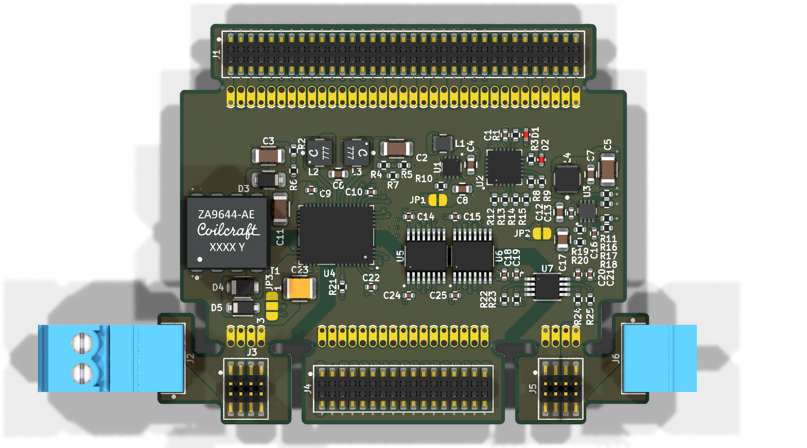
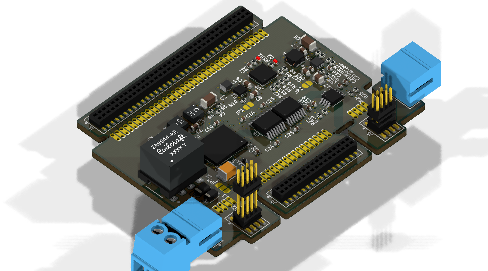

# AD74416H Power Interface Module

## Overview

This repository provides a comprehensive KiCad design for a power and interface module tailored for the Analog Devices AD74416H. This module is designed to supply the necessary power rails and handle digital communications, making it an essential companion for projects utilizing the [Minimal_AD74416H](https://github.com/ionutms/Minimal_AD74416H) board or other AD74416H-based systems.

## Disclaimer

> [!NOTE]
> This project is provided "as is" and without any warranty, express or implied. For more details, please see the [LICENSE](LICENSE) file.

## About the Module

The AD74416H Power Interface Module is engineered to simplify the integration of the AD74416H by providing a stable and reliable power source and a straightforward digital interface. It takes a single power input and generates all the required voltage levels for the AD74416H and its peripherals.

Key features of this module include:

- **Power Supply Generation:** Onboard regulators to generate the necessary positive and negative supply rails for the AD74416H.
- **Digital Interface:** Provides a clear and accessible interface for SPI communication and other digital signals.
- **Modular Design:** Designed to seamlessly connect with the Minimal_AD74416H board.
- **User-Friendly Connectors:** Equipped with standard connectors for easy integration into larger systems.

## Project Structure

```
ad74416h_power_interface_module/
├── ad74416h_power_interface_module.kicad_pro      # Project configuration file
├── ad74416h_power_interface_module.kicad_sch      # Main schematic file
├── ad74416h_power_interface_module.kicad_pcb      # PCB layout file
├── fp-lib-table                                   # Footprint library table
├── sym-lib-table                                  # Symbol library table
├── docs/                                          # Documentation files
│   ├── bom/                                       # Bill of Materials
│   │   └── ad74416h_power_interface_module_ibom.html # Interactive BOM file
│   ├── pictures/                                  # Images and photos
│   │   ├── 1_ad74416h_power_interface_module_side.png   # Side view of PCB
│   │   ├── 2_ad74416h_power_interface_module_top.png    # Top view of PCB
│   │   └── 3_ad74416h_power_interface_module_bottom.png # Bottom view of PCB
│   └── schematics/                                # Schematic PDF exports
│       └── ad74416h_power_interface_module_schematics.pdf # Complete schematics PDF
└── KiCAD_Symbols_Generator/                       # Submodule for symbol generation from CSV data
```

## Project Features

This design provides a robust power and interface solution for the AD74416H with:

-   Efficient power conversion and regulation
-   Clear separation of analog and digital grounds
-   Easy-to-use connectors for power and data
-   A compact and modular PCB design

## Getting Started

### Prerequisites

-   [KiCad EDA](https://www.kicad.org/) version 9.0 or later installed on your system
-   Git (for cloning the repository and submodule management)

### Opening the Project

1.  **Clone the repository** (including submodules):
    ```bash
    git clone --recursive https://github.com/ionutms/AD74416H_Power_Interface_Module.git
    ```

    If you've already cloned the repository without submodules, initialize them with:
    ```bash
    git submodule init
    git submodule update
    ```

2.  **Open the project in KiCad**:
    -   Launch KiCad
    -   Click "Open Existing Project"
    -   Navigate to the cloned repository folder
    -   Select the `ad74416h_power_interface_module.kicad_pro` file

3.  **Explore the design**:
    -   Open the schematic editor to view the circuit design
    -   Open the PCB editor to view the board layout
    -   Review the symbol and footprint libraries used in the design

### Project Files

-   **Main schematic**: `ad74416h_power_interface_module.kicad_sch` - Contains the primary circuit design for the power supply and digital interface.
-   **PCB layout**: `ad74416h_power_interface_module.kicad_pcb` - Physical board design file.
-   **Project configuration**: `ad74416h_power_interface_module.kicad_pro` - KiCad project settings.

## Dependencies

This project has the following dependencies:

### 1. KiCAD Symbols Generator

This repository uses [KiCAD_Symbols_Generator](https://github.com/ionutms/KiCAD_Symbols_Generator) as a submodule for custom symbol generation.

To initialize the submodule after cloning this repository:

```bash
git submodule update --init --recursive
```

### 2. 3D Models

This project requires the [3D_Models_Vault](https://github.com/ionutms/3D_Models_Vault) repository for 3D models.

#### Setup for KiCAD 9:

1.  Clone the 3D models repository:
    ```bash
    git clone https://github.com/ionutms/3D_Models_Vault.git
    ```

2.  In KiCAD 9, add an environment variable:
    -   Variable name: `KICAD9_3D_MODELS_VAULT`
    -   Variable value: Full path to where you cloned the 3D_Models_Vault repository

## Usage

After setting up the dependencies, open the project in KiCad 9 to access all features including the 3D models. This module can be used to power and communicate with the [Minimal_AD74416H](https://github.com/ionutms/Minimal_AD74416H) board.

## Symbol Generator Submodule

This project includes the KiCAD_Symbols_Generator as a submodule, which provides tools for generating KiCad symbols from CSV data files. For more information on using this tool, see the [KiCAD_Symbols_Generator documentation](ad74416h_power_interface_module/KiCAD_Symbols_Generator/README.md).

## Documentation

The `docs` folder contains:
-   Schematic PDF exports
-   Images and photos of the design

## Visuals

The following images showcase the PCB design from different perspectives:


*Top View of the PCB*


*Side View of the PCB*


*Bottom View of the PCB*

## License

This project is licensed under the MIT License - see the [LICENSE](LICENSE) file for details.

## References

-   [AD74416H Datasheet](https://www.analog.com/media/en/technical-documentation/data-sheets/ad74416h.pdf)
-   [KiCad EDA](https://www.kicad.org/)